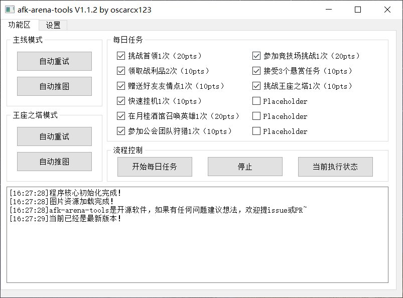

# afk-arena-tools

## 简介

使用 Python + OpenCV + PyQt5 + adb 制作的AFK Arena / 剑与远征 辅助。

原理是OpenCV识别图片，adb负责截图和点击操作，仅此而已。

  
    
  <b>游戏界面</b>

既然已经来了，不点个star鼓励下作者吗？

## 运行说明

电脑需要安装：

* Python3.6或以上版本
* OpenCV
* adb（Android Debug Bridge）
* PyQt5（从pip安装即可）

因为使用到ADB，只能作用于安卓手机。

目前Manjaro Linux上测试通过，Windows上仍需要一些适配。

运行main.py即可～

## 操作说明

连接adb后点击对应功能即可。

## 开发计划

*  适配Windows系统
*  一键完成每日必做的任务
*  一键打迷宫（感觉本菜鸡水平不足，不一定能做到）

## 更新说明

### 2019.10.18 V1.0.0

* [x] 最初版本发布
