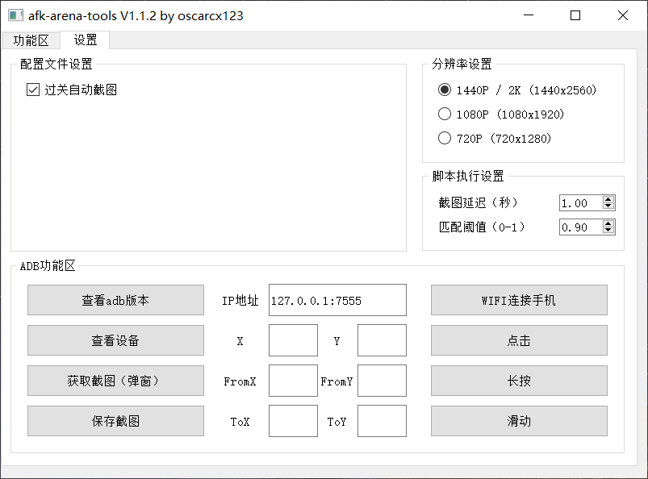

# afk-arena-tools

## 简介

使用 Python + OpenCV + PyQt5 + adb 制作的AFK Arena / 剑与远征 辅助。

日常任务功能暂时不兼容120级或VIP6以下玩家（issue #6）。

有各种问题、建议、想法，欢迎开issue或者提PR~

<p align="center">
  
  <br>
  <b>主界面</b>
  <br><br>
  
  <br>
  <b>设置界面</b>
  <br><br>
</p>

既然已经来了，不点个star鼓励下作者吗？

## 运行说明

目前以下操作系统测试通过：
* Windows 10 (ver 1903)
* Raspbian 10 (buster) armv7l
* Manjaro (5.6.19-2-MANJARO)

电脑需要安装：
* Python3.6或以上版本
* adb（Windows版本的release包自带）
* OpenCV（从pip安装）
* PyQt5（从pip安装）
* requests（从pip安装）

Windows输入下面指令即可安装
```
pip install requests opencv-python PyQt5
```

Linux看[这里](./_docs/run_on_linux.md)

双击启动脚本即可，或者运行main.py。如果要隐藏黑框，可以用pythonw运行。

## 操作说明

分辨率在“杂项”菜单选择，默认分辨率为1440p，如果你的设备不是这个分辨率，务必更改为其它选项，否则会出现能匹配但是点不到的问题。

注意事项：
* 主线的自动重试功能需要进入选择队伍页面（正下方有“战斗”字样）才能使用
* 主线的自动推图功能在“战役”页面即可使用
* 王座之塔相关功能需要进入具体的塔才能使用
* 日常任务功能需要在任意一个主界面开始（要能看见底端的页面栏，包括领地、野外、战役等）

### 安卓手机

进入“开发者选项”，打开“USB调试”就行。可以使用USB线连接电脑，或者在局域网下连接。

### 模拟器

理论上所有模拟器都行，部分测试过的模拟器可以在[这里](./_docs/using_emulator.md)找到。

## 更新说明

### 2020.09.28 V1.1.3

V1.1.3是当前架构下最后一个版本，后续版本会大改

* [x] 修复31章后无法自动多队推图问题

### 2020.07.25 V1.1.2

本咸鱼两周前进入了30章，纪念下，顺便吹爆绿罩~

* [x] 加入了检查更新相关代码
* [x] 图片资源延迟加载防止阻塞GUI
* [x] 通关之后给提示，并提供自动截图的选项
* [x] 打包脚本的zipfile.ZIP_STORED替换成zipfile.ZIP_DEFLATED

### 2020.06.25 V1.1.1

本咸鱼终于进入了29章，心情不错，修一波bug，再增强一下图形界面的功能~

* [x] 修复了读取分辨率配置不生效的问题
* [x] 修复了无console模式仍然弹窗的问题
* [x] 修复了公会boss胜利界面点不掉的问题
* [x] 删除了过时的ratio选项
* [x] 删除了没用的About和Help窗口
* [x] 改进了“匹配-执行”的过程，清理了很多无用函数
* [x] 选择了一个折中的停止实现方式，点击停止后可能还会有部分残余指令继续执行
* [x] 用ThreadPoolExecutor代替Thread，能返回更多信息
* [x] 图形界面增加更多配置
* [x] 捕获匹配不到底栏图标的错误

### 2020.06.16 V1.1.0

* [x] 一键完成每日必做的任务（issue #5）
    * [x] 挑战首领1次（20pts）
        * 进去之后退出来
    * [x] 领取战利品2次（10pts）
        * 会在开头和结尾分别执行一次
    * [x] 赠送好友友情点1次（10pts）
    * [x] 快速挂机1次（10pts）
        * 只使用每日的免费次数挂机
    * [x] 在月桂酒馆召唤英雄1次（20pts）
        * 只抽友情池
    * [x] 参加公会团队狩猎1次（10pts）
        * 自动扫荡哥布林和剑魂
    * [x] 参加竞技场挑战1次（20pts）
        * 使用全部免费票，直接打最下面的
    * [x] 接受3个悬赏任务（10pts）
        * 使用内置一键派遣（需要达到v6，白嫖玩家需要达到120级）
    * [x] 挑战王座之塔1次（10pts）
        * 进去之后退出来
* [x] 新版的UI
* [x] 增加用户配置文件

### 2020.02.16 V1.0.7

* [x] 修复推图时遇到升级弹窗停下的问题（issue #4）

### 2020.01.23 V1.0.6

* [x] 截图方式改为直接读取stdout
* [x] 杂项中的截图功能改成直接弹窗显示，不再保存到本地
* [x] 每轮截图匹配之间增加1秒延时，防止截图太快造成（没什么影响的）连续点击

之前截图使用通用的方法，就是adb获取截图，通过pipe保存到本地，然后opencv读取。然而我发现，这么搞，硬盘写入量好像挺大啊，一小时写入10G妥妥的。捣鼓了半天，终于做到了直接从stdout读取图片，无需多走一步保存到本地。有需要的朋友可以参考get_img的实现。

### 2020.01.20 V1.0.5

* [x] 现在主线的“自动推图”可以处理通过特定关卡后弹出的限时礼包窗口
* [x] 增加战役页面的“挑战首领”图标检测
* [x] 修复打包脚本（之前忘了打包图片）

### 2020.01.17 V1.0.4

* [x] 修复推图到boss关就停下的问题（issue #3）

### 2020.01.12 V1.0.3

没想到真有人用，很开心，打算继续填坑

* [x] Command部分重构
* [x] 多分辨率适配（720p, 1080p, 1440p）
* [x] 重新制作匹配素材，分辨率为1440p

有时候好像会连着点两次，可能是截图太快了，反正不影响使用

### 2020.01.11 V1.0.2

* [x] 替换老旧的匹配目标图片
* [x] 适配新版游戏流程

### 2019.10.20 V1.0.1

* [x] 适配Windows系统
* [x] adb连接使用子线程防止阻塞

### 2019.10.18 V1.0.0

* [x] 最初版本发布
