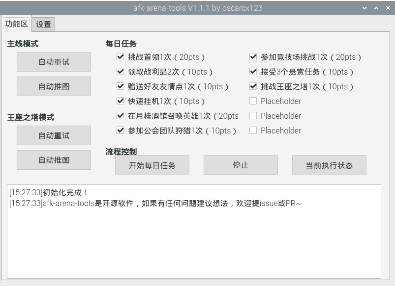

用Linux的就默认是技术大佬了，我只是个Linux菜鸟，遇到疑难杂症别来找我，我也无能为力（摊手.jpg）

# Raspbian 10 (buster) armv7l

## 安装adb

首先运行下面的指令安装`adb`

```
sudo apt-get install adb android-sdk-platform-tools-common
```

安装之后看一眼版本是否正确。值得一提的是，如果使用`Raspbian 9 (Stretch)`的话，安装的`adb`版本是`1.0.36`，有可能没法用。

```
pi@raspberrypi:~ $ adb --version
Android Debug Bridge version 1.0.39
Version 1:8.1.0+r23-5
Installed as /usr/lib/android-sdk/platform-tools/adb
```

然后用adb检测下设备，此时应该是能认出设备的，不过出错就对了，因为在Linux上用adb要稍微麻烦一点。

```
pi@raspberrypi:~ $ adb devices
List of devices attached
* daemon not running; starting now at tcp:5037
* daemon started successfully
18*************	no permissions (user in plugdev group; are your udev rules wrong?); see [http://developer.android.com/tools/device.html]
```

【解决方案一】手动添加单条规则

用`lsusb`查看`vendor id`和`product id`，然后创建新规则并重载。具体可以看[这里](https://stackoverflow.com/questions/53887322/adb-devices-no-permissions-user-in-plugdev-group-are-your-udev-rules-wrong)

【解决方案二】偷懒

网上当然有[整理好的设备规则大全](https://github.com/snowdream/51-android)，执行下面命令即可。

```
sudo curl --create-dirs -L -o /etc/udev/rules.d/51-android.rules -O -L https://raw.githubusercontent.com/snowdream/51-android/master/51-android.rules
sudo chmod a+r /etc/udev/rules.d/51-android.rules
sudo service udev restart
```

上面搞定之后，记得重新插拔下usb线，然后就可以愉快使用adb了。

## 安装辅助依赖

特别不建议直接通过pip安装，容易出各种乱七八糟的错误。因此直接使用下面命令安装`pyqt`和`opencv`。

```
sudo apt-get install python3-pyqt5 python3-opencv
```

然后就大功告成啦~

